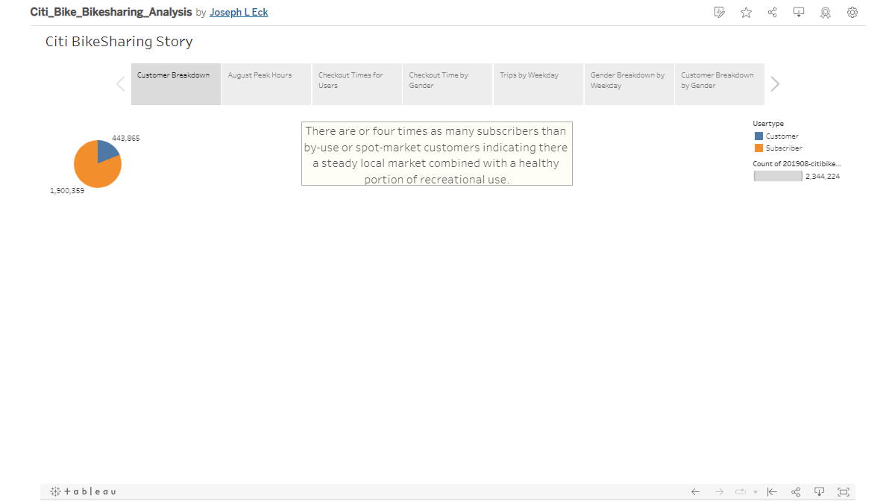
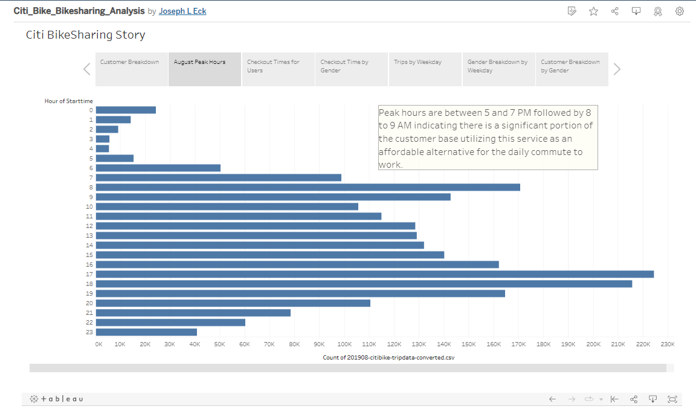
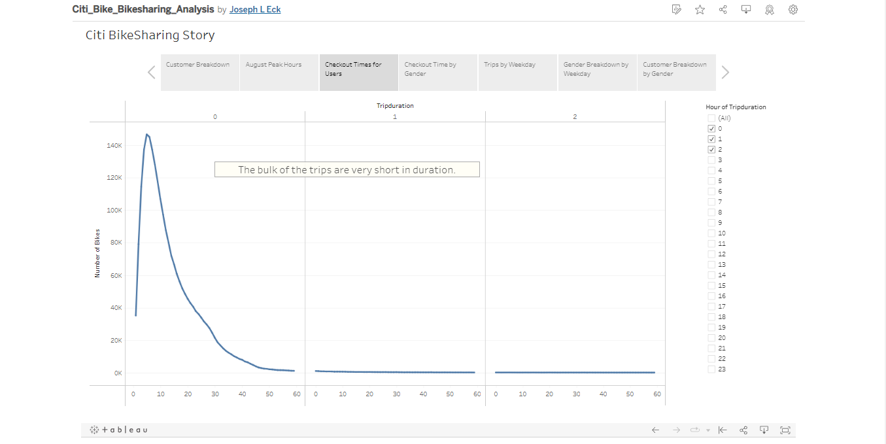
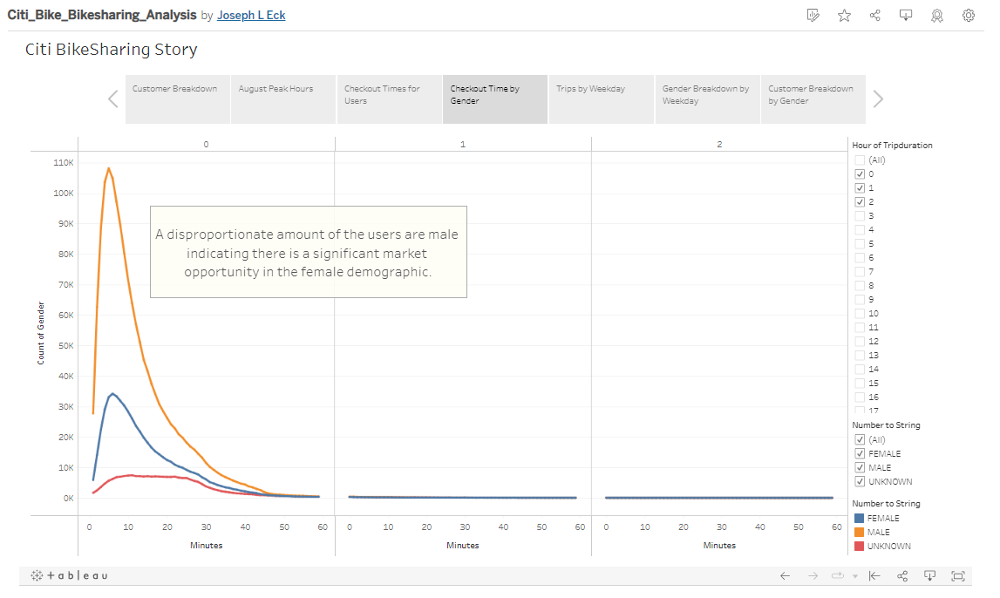
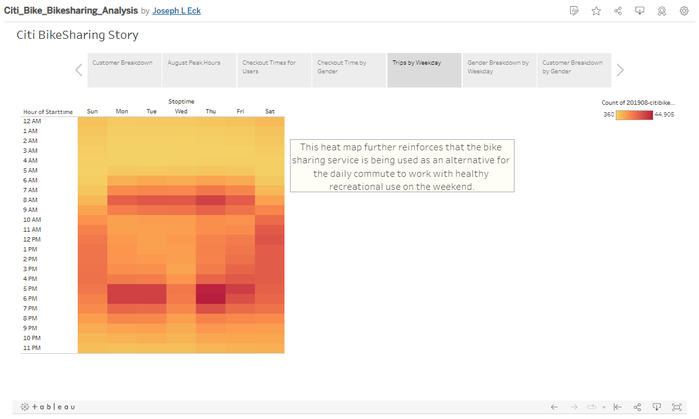
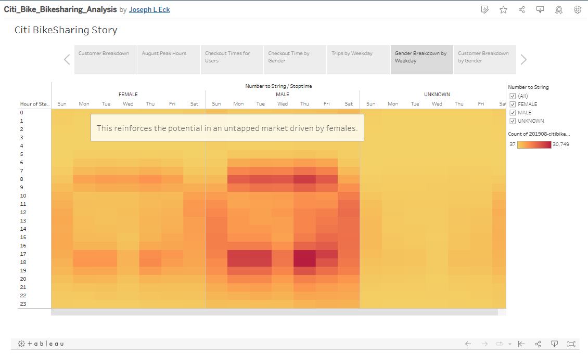
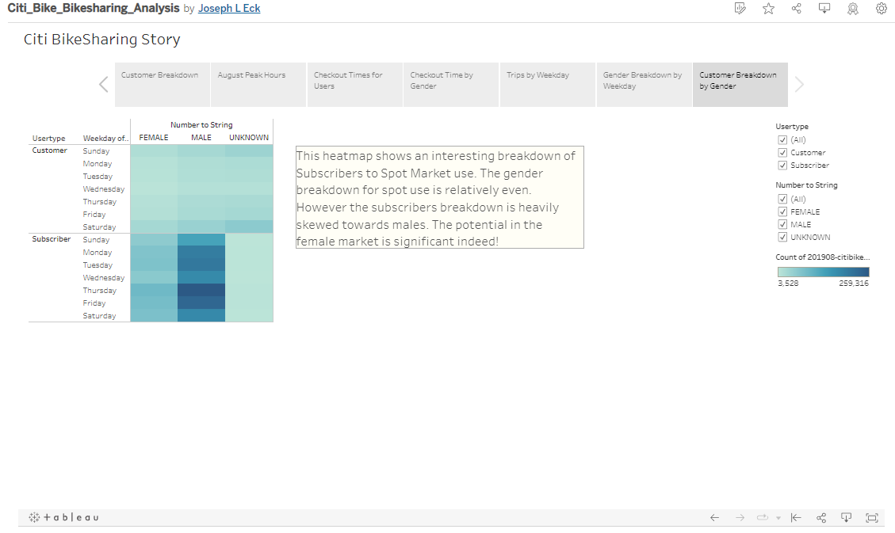

# City Bike Bike-Sharing Analysis

## Overview
The purpose of this analysis is to analyze data from an existing bike sharing program in New York City to assess the viability of such a program in Des Moines, IA.

## Data
- Data was downloaded from Citi Bike for August of 2019 in Ney Yor City

## Results
The first piece of data pertains to customer base. As can be seen in the graphic below, there are ~2.3M customers with 1.9M of those being subscribers as opposed to the ~.4M that make up the spot market or recreational use.

The next finding relates to peak usage hours. The graphic below clearly shows the peak usage times are 5 to 7 PM and 8 to 9 AM. The indicates that the bike sharing program is being used heavily for the daily commute to work.

Checkout times were analyzed next, shown below. It shows the usage is mostly very short duration, ~5 minutes.

To continue to analyze the data, gender was chosen to see if there was anything telling to be seen. The following graphic clearly indicates the customer base is primarily male.

A story is beginning to take shape. Displayed below is a heat map that further reinforces the usage times by weekday.

Just to reinforce the gender differential by weekday, the below graphic in the form of another heat map shows the skew of the customer base to males but still indicating the primary use by both genders is the daily commute to and from work.

Finally, the last heat map shown below is the most important. It very clearly shows that, while the recreational spot market use is relatively balanced between the genders, the subscriber use is predominately male and concentrated in the Monday thru Friday work week.

## Summary
Viewing the graphics compiled above, the results are clear. The primary user of the Citi Bike service in New York is not tourist/recreational related. Rather it is local subscribers, primarily male, using the service as an alternative to the daily commute back and forth to work. What should be noted is the large disparity between male and female usage.

The original question, however, must be answered. The answer is compelling. The bike share service's primary income source is not tourist related. As such, the tourist market in Des Moines is not a factor. There is more than enough market for daily commuters. Furthermore, with the demographics skewed heavily to the males, it indicates there is a huge potential in an underserved market with respect to female commuters indicating that marketing the program may require different approaches with respect to males and females. Potential rewards for such a marketing approach are significant.
